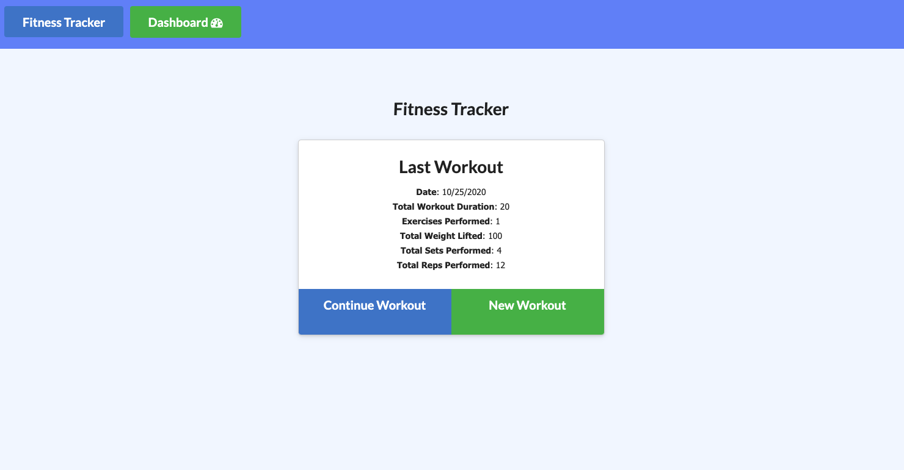
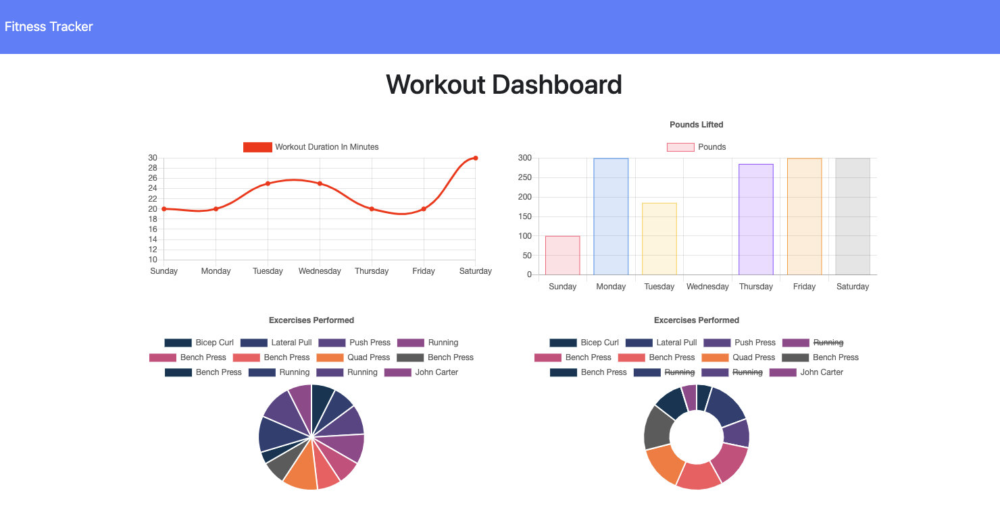

# Workout Tracker

## Description
It is an application to view create and track daily workouts. It allows the user to track the name, type, weight, sets, reps, and duration of exercise. If the exercise is a cardio exercise, the user can track the distance traveled. The app is built using mongoose a module of MongoDb, Express and morgan modules.  
## Table of contents
* [Description](#Description)
* [Link](#Link)
* [Usage](#Usage)
* [License](#License)
* [Contributing](#Contributing)
* [Screenshot](#Screenshot)
* [Questions](#Questions)
## Link
[Click here to view the deployed app](https://kev-workout-tracker.herokuapp.com/).
## Usage
The home page dislays the last performed workout. Click on continue Workout to continue with the same workout plan or click on New Workout to add a new workout. Click on dashboard to track your daily progress.
## Licence
This app is under the MIT License.
## Contributing
I would be happy if anyone decide to improve it. All comments and suggestions are welcomed.
## Screenshot
 

## Questions
Contact me: kevkouadio@gmail.com

My Github: http://github.com/kevkouadio